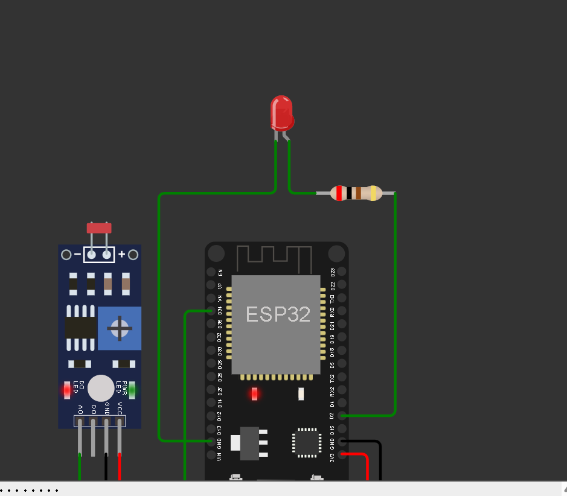

# Smart Lamp com FIWARE – Edge Computing CP4

## Montagem no Wokwi

<p align="center">
  
</p>

---

## Contexto Acadêmico

Este projeto foi desenvolvido como o **Checkpoint 4 (CP4)** da disciplina de **Edge Computing**, dando continuidade ao trabalho anterior da equipe no [Edge-Computing-CP2](https://github.com/Tkkulesza/Edge-Computing-CP2). O objetivo deste checkpoint é integrar um dispositivo embarcado (ESP32) a uma plataforma **FIWARE** completa, aplicando conceitos de IoT ponta a ponta: coleta no dispositivo, transporte via **MQTT**, padronização via **NGSI** e persistência/consulta de histórico em nuvem.

---

## Sobre o Projeto

Este projeto em **C++ para ESP32** implementa uma **lâmpada inteligente (Smart Lamp)** que publica sua luminosidade ambiente e recebe comandos remotos de liga/desliga através de uma stack **FIWARE** (Orion Context Broker, IoT Agent MQTT e STH-Comet) hospedada em uma instância **AWS EC2**.

O sistema utiliza:

- **ESP32 (Wokwi)** – executa o firmware, conecta ao Wi-Fi e ao broker MQTT.
- **Fotoresistor (LDR)** – mede a luminosidade ambiente (entrada analógica, `GPIO 34`).
- **LED + resistor de 200 Ω** – representa a lâmpada, controlada remotamente via MQTT (`GPIO 2`).
- **Mosquitto (MQTT Broker)** – recebe a telemetria do ESP32 e os comandos vindos do FIWARE.
- **IoT Agent MQTT (FIWARE)** – traduz as mensagens MQTT para o modelo de dados NGSI.
- **Orion Context Broker (FIWARE)** – mantém o estado atual da entidade `urn:ngsi-ld:Lamp:001`.
- **STH-Comet (FIWARE)** – armazena e disponibiliza o histórico de luminosidade.
- **Postman** – usado para provisionar os dispositivos no FIWARE e enviar os comandos `on`/`off`.

---

## Funcionamento

1. O **ESP32** conecta-se à rede Wi-Fi (`Wokwi-GUEST`, na simulação) e ao broker **MQTT** (Mosquitto, na AWS).
2. O **LDR** é lido a cada ciclo (`analogRead` no `GPIO 34`) e convertido para uma escala de **0–100**, publicada no tópico `/TEF/lamp001/attrs/l`.
3. O estado atual do LED (`on`/`off`) é publicado no tópico `/TEF/lamp001/attrs`.
4. O **IoT Agent** encaminha essas leituras para o **Orion**, atualizando os atributos `luminosity` e `state` da entidade `urn:ngsi-ld:Lamp:001`.
5. Comandos enviados via **Postman** (`PATCH .../attrs`) chegam ao Orion, são repassados ao IoT Agent (registration com `legacyForwarding: false`) e publicados no tópico `/TEF/lamp001/cmd`, ligando/desligando o LED no `GPIO 2`.
6. Uma **subscription** no Orion notifica o **STH-Comet** a cada mudança de `luminosity`, permitindo consultar o histórico (`lastN`) posteriormente.

---

## Componentes Utilizados

| Componente                     | Quantidade |
|---------------------------------|------------|
| ESP32 DevKit V1                 | 1x         |
| Módulo fotoresistor (LDR)       | 1x         |
| LED vermelho                    | 1x         |
| Resistor de 200 Ω (LED)         | 1x         |
| Instância AWS EC2 (Ubuntu)      | 1x         |
| Stack FIWARE via Docker Compose (Orion, IoT Agent, STH-Comet, Mosquitto, MongoDB) | 1x |

---

## Bibliotecas Necessárias

Instale via **Arduino IDE → Gerenciar Bibliotecas** (ou já incluídas em `libraries.txt` no Wokwi):

| Biblioteca       | Finalidade                          |
|------------------|--------------------------------------|
| `WiFi`           | Conexão Wi-Fi do ESP32 (nativa)      |
| `PubSubClient`   | Cliente MQTT (publish/subscribe)     |

---

## Como Reproduzir o Projeto

### 1. Clonar o Repositório

```bash
git clone <url-deste-repositorio>
```

### 2. Subir a stack FIWARE (AWS EC2 ou qualquer host com Docker)

```bash
cd cp4-smart-lamp-fiware
docker compose up -d
docker ps   # orion, iot-agent, sth-comet, mosquitto e os dois mongo devem ficar healthy/running
```
Guia completo (Security Group, provisionamento no Postman, registration, subscription): [`docs/GUIA_PASSO_A_PASSO.md`](./docs/GUIA_PASSO_A_PASSO.md).

### 3. Provisionar a Smart Lamp no FIWARE

Importe `postman/CP4_SmartLamp.postman_collection.json` no Postman, configure a variável `url` com o IP público da EC2 e siga a pasta **IOT Agent MQTT** na ordem numerada.

### 4. Carregar o Código no ESP32

Abra `codigo.ino`, atualize `default_BROKER_MQTT` com o IP público atual da EC2 e faça o upload para a placa (ou rode direto no Wokwi).

### 5. Simulação no Wokwi

[Simulação no Wokwi](https://wokwi.com/projects/474875563203324929)
(baseado no projeto de referência do professor Fábio Cabrini: [wokwi.com/projects/379067485841192961](https://wokwi.com/projects/379067485841192961))

### 6. Alternativa sem Wokwi: simulador Python

```bash
pip install paho-mqtt
python3 scripts/esp32_mockup_SmartLamp.py
```

### 7. Vídeo de Demonstração

[Assistir no YouTube](https://youtu.be/pdYtPGcd9yc)

---

## Créditos

Projeto desenvolvido a partir da base **FIWARE Descomplicado** ([github.com/fabiocabrini/fiware](https://github.com/fabiocabrini/fiware)) e do exemplo `fiware_ngsi_mqtt_esp32.ino`, ambos de autoria do professor **Fábio Henrique Cabrini**, sob licença MIT (mantida em [`LICENSE`](./LICENSE)).

---

## Integrantes

| Nome completo         | RM     | Turma  | Função        |
|-----------------------|--------|--------|---------------|
| Enrico Vidal          | 569217 | 1 ESPG | Desenvolvedor |
| Guilherme de Rosa     | 569193 | 1 ESPG | Desenvolvedor |
| Marcella Pinheiro     | 569457 | 1 ESPG | Desenvolvedor |
| Thiago Kulesza        | 568922 | 1 ESPG | Desenvolvedor |
| Vinicius Cavalcanti   | 570818 | 1 ESPG | Desenvolvedor |
| Isabella Yogui Kohara | 569777 | 1 ESPG | Desenvolvedor |